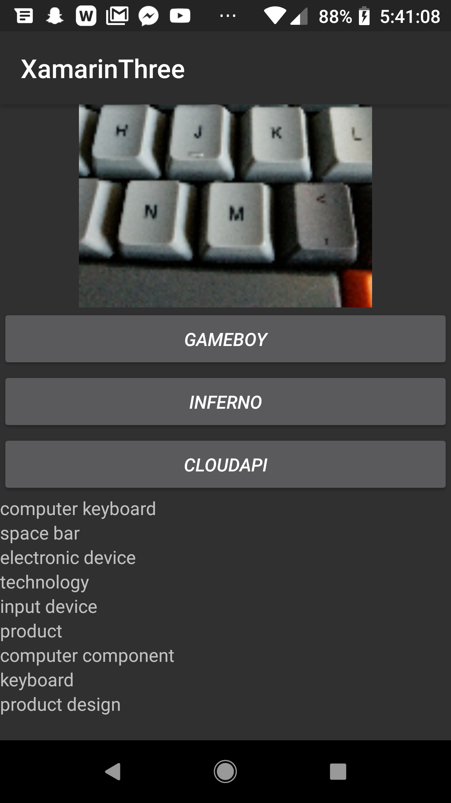
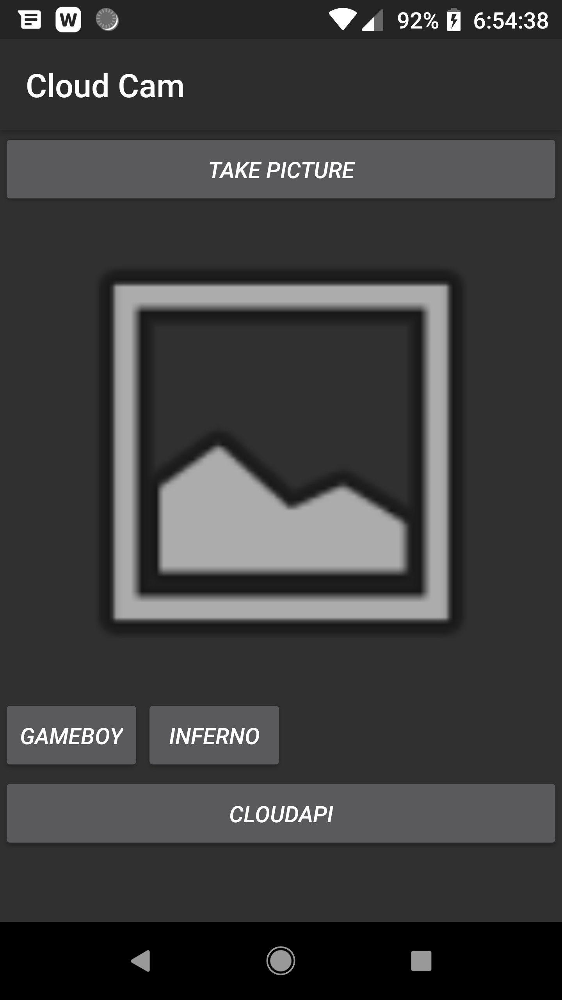

# Cloud Cam
There are a lot of parallels between this app and pa2's app

This application can take pictures, compress them down, and then send them to google's cloud API, where the API will take it and try and figure out what it contains. It then sends the results back.

This application also carries functionality from PA2 in how it can manipulate photos.

## System Design
Required to run this program is Android 5.0 or later.
Network permissions aren't needed. Camera permissions aren't needed.
No screensize constraint vertically, but a screen size of >2"@310dpi recommended.
While network permissions aren't needed (as data passes through android's google cloud api and not the network stack) a working internet connection is required to generate the list of guesses.

## Usage

When opening the program you're greeted with the same imageview and camera button from PA2, but with an added CloudApi button underneath.
After taking a pictue, hitting the "CLOUDAPI" button will cause the image to be compuressed and uploaded to google's AI services where a chunk of data will be returned with guesses and percentages of certainty.